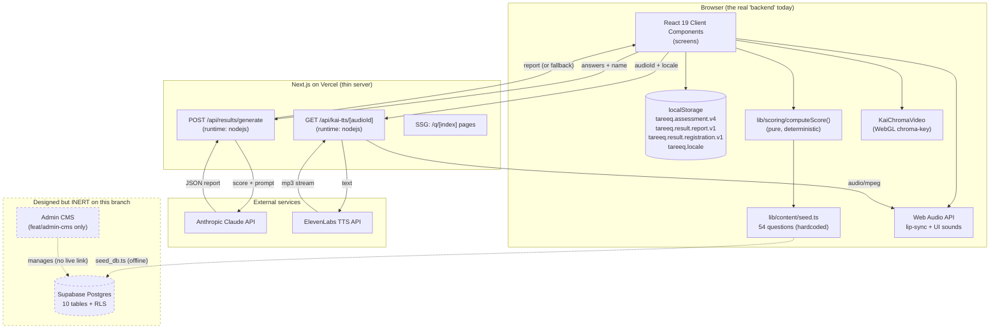
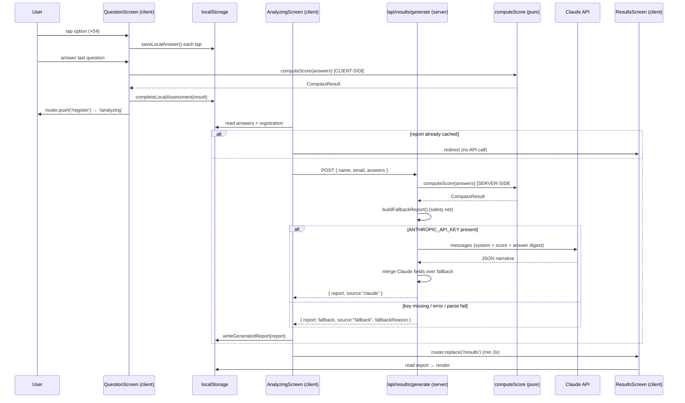

# Tareeq — Technical Architecture Review

> **Audience:** another AI (or engineer) that needs to understand exactly how this product works *today*.
> **Method:** every claim below was derived by reading actual source and tracing execution paths — not from the planning docs. Where the planning doc (`ARCHITECTURE.md`) and reality disagree, reality wins and the gap is called out.
> **Branch analyzed:** `feat/bilingual-assessment` (the current working branch and the canonical source of truth for this review).
> **Date:** 2026-06-14

---

## 0. Reader's orientation: the three things that surprise everyone

Before the section-by-section breakdown, three facts reframe the entire system. Internalize these first or the rest will mislead you.

1. **The running app has no database connection.** Despite a fully-designed Drizzle + Supabase schema (10 tables, RLS, triggers), **zero runtime code in `app/` or `lib/` connects to Postgres or Supabase.** All user state — answers, progress, registration, consent, the generated report — lives in the browser's `localStorage`. The Supabase client is only imported by an offline seed script. The DB is, on this branch, an inert planning artifact.

2. **The live AI is Claude, not Gemini.** The request asked for a "Gemini Integration" section. On this branch, results generation calls **Anthropic Claude** (`claude-sonnet-4-20250514`) directly over REST. `GEMINI_API_KEY` exists in `.env` but is referenced by **no source file** here. A real Gemini provider abstraction (`gemini-2.5-flash`) *does* exist — but only on the `feat/admin-cms` branch. Section 4 documents both honestly.

3. **The admin CMS is on a different branch (`feat/admin-cms`) and is currently "write-only."** It can manage questions/versions in the DB through a polished editor, but the assessment the student actually takes is read from a hardcoded TypeScript file (`lib/content/seed.ts`). Nothing bridges the CMS's DB content to the live app yet. Every CMS edit is cosmetically correct but has **no effect on students**.

Everything that follows elaborates these three realities.

---

## 1. Product Overview

### What problem it solves
**Tareeq** ("path" in Arabic) is a **career-discovery compass for youth in the MENA region** — the target persona is a ~17-year-old in the Middle East choosing high-school subjects, a university major, and a career direction. It replaces generic "personality-type" tests with a guided, non-prescriptive assessment that points toward *career families* and *energy patterns* rather than handing down a fixed label. The product framing is explicit (from the live system prompt): *"provide guidance, not personality labels; never present the top cluster as a fixed destiny."* The headline promise: **"12 minutes, 60 questions, one clear path."** (Actual count is 54 questions; the "60" is marketing copy.)

### Who the users are
| User type | Surface | Status on this branch |
|---|---|---|
| **End user (student)** | The assessment flow (`/intro` → `/results` → `/profile`) | Fully built, anonymous, local-only |
| **Admin (content manager)** | `/admin/*` CMS | Exists **only on `feat/admin-cms`**; real Supabase auth + RBAC |
| **Researcher (future)** | `assessment_data` / `user_outcomes` tables | Schema designed; no UI; not populated |

### Major features (as actually built)
- A **guided 54-question assessment** organized by the proprietary **CORE model** (Curiosities, Operations, Rewards, Ecosystems).
- **"Kai,"** an animated AI guide character (a video composited live via a WebGL green-screen shader) with **voiced narration** (ElevenLabs TTS) and amplitude-driven **lip-sync**.
- A **deterministic scoring engine** that maps answers to a career-cluster ranking, an archetype, motivational drivers, and an ecosystem-fit profile.
- An **AI-personalized results report** ("Career Compass") generated per-user by Claude, with a deterministic fallback if the AI is unavailable.
- **Bilingual EN/AR** support with a custom i18n engine, RTL, a dedicated language chooser, and self-hosted Arabic fonts (the focus of this branch).
- A **persistent profile** screen showing journey progress and (locked) future modules.
- (On `feat/admin-cms`) a **content management system** with versioning, a Typeform-style question builder, and CSV import.

### The main user journey (one line)
Pick language → meet Kai → accept a "quiet contract" → answer 54 questions (with milestone "Did You Know" interstitials) → register name/email → AI generates the Career Compass → view results → land on a persistent profile.

---

## 2. System Architecture

### 2.1 Stack at a glance

| Layer | Technology | Notes |
|---|---|---|
| Framework | **Next.js 15** (App Router) + **React 19** | `next ^15.0.0`, route groups, SSG for question routes |
| Language | **TypeScript 5** | strict types in `lib/`; some `as unknown as` casts at the seed→question boundary |
| Styling | **Tailwind CSS 3.4** + CSS custom properties | Custom "Orbit" token system in `globals.css` + `tailwind.config.ts` |
| Client state | **`localStorage`** | No Redux/Zustand/Context store for data; React state is per-screen only |
| AI (results) | **Anthropic Claude** via raw `fetch` | `claude-sonnet-4-20250514`; Gemini provider on `feat/admin-cms` |
| TTS | **ElevenLabs** via server proxy | voice `ZF6FPAbjXT4488VcRRnw`, model `eleven_multilingual_v2` |
| Character | **Custom WebGL** chroma-key shader (not Three.js) | `@react-three/*` and `three` are installed but **unused dead deps** |
| DB / Auth (designed) | **Supabase** (Postgres + Auth) + **Drizzle ORM** | Schema + migrations exist; **not wired into runtime on this branch** |
| Hosting | **Vercel** (project `tareeq`, Node 24.x) | Zero-config Next.js build |
| i18n | **Custom** locale engine | `next-intl` installed but **unused** |
| Validation | **Zod 4** | Used in admin server actions; **not** in the public API routes here |

### 2.2 High-level architecture diagram



### 2.3 Frontend structure
- **App Router with route groups.** `app/(marketing)/` (a single page that `redirect()`s to `/intro`) and `app/(assessment)/` (every user-facing screen). Group names do not appear in URLs.
- **Rendering model: effectively CSR.** Page files are thin server-component shells; each immediately renders a `"use client"` screen component. The only page with meaningful server logic is `app/(assessment)/q/[index]/page.tsx`, which uses `generateStaticParams()` to **statically generate all 54 question routes**.
- **No global store.** Cross-screen data flows through `localStorage`, read/written by typed helpers in `lib/assessment/progress.ts` and `lib/results/storage.ts`.

### 2.4 Backend structure
The "backend" is two Next.js route handlers (`runtime = "nodejs"`), both stateless and unauthenticated:
- `POST /api/results/generate` — scores answers server-side and calls Claude.
- `GET /api/kai-tts/[audioId]` — proxies ElevenLabs TTS, keeping the key server-side.

There are **no server actions, no middleware, no auth callback** on this branch (all of those exist only on `feat/admin-cms`).

### 2.5 Database technology
**Supabase Postgres** with **Drizzle ORM** for schema definition. See §6. Critically: **not connected at runtime on this branch.**

### 2.6 Authentication flow
**There is none on this branch.** The app is fully **anonymous and local-only**:
- `/register` collects name + email and **displays a 6-digit "verification code" directly in the UI** (`createVerificationCode()` via `crypto.getRandomValues`), with a literal comment: *"Prototype mode shows the code here. In production this connects to an email provider."* No email is sent; no network call leaves the browser.
- On "verify," it writes `{ name, email, verifiedAt, consent }` to `localStorage` key `tareeq.result.registration.v1`.
- `/profile` gates on the presence of that localStorage record, not on any session.

Real authentication (Supabase email/password + RBAC + middleware session refresh) exists **only on `feat/admin-cms`**, and only for `/admin/*` (see §5).

### 2.7 API architecture
REST-ish, minimal — two route handlers (full contract in §7). No versioning, no envelope, no auth, no rate limiting. The design philosophy on this branch is "do as much as possible in the browser; reach the server only for things that need a secret key (Claude, ElevenLabs)."

### 2.8 Third-party integrations
- **Anthropic Claude** — results narrative generation (runtime, per-user).
- **ElevenLabs** — Kai voice narration (runtime proxy, with pre-baked fallback).
- **Supabase** — designed for DB/Auth/Storage; only used by the offline seed script here.
- **Google Cloud TTS / Coqui XTTS** — referenced by the Python `bake_audio.py` build script for generating static audio; not part of the app runtime.

### 2.9 AI integrations
- **Claude** (results) — see §4.
- **Gemini** (`gemini-2.5-flash`) — a fully-built provider on `feat/admin-cms` (`lib/results/providers.ts`), env-switchable with Claude; **absent from this branch**.

### 2.10 Deployment architecture
- **Vercel**, project `tareeq` (`projectId: prj_19fgoNGi19ASAfwEuSerhQ8JFqC2`, `orgId: team_NCTTlMfZHO8kKllWwux1vOEi`), framework auto-detected (all build commands `null`), **Node 24.x**.
- `next.config.ts` is minimal: only `outputFileTracingRoot`. No custom headers, rewrites, image domains, or `output: "export"`.
- **Audio + video assets are served as static files** from `public/audio/`, `public/audio_ar/`, and `public/kai/` via Vercel's edge CDN. No Supabase Storage.
- Preview deploys per branch (e.g. the `feat/kai-video-refinements` branch was aliased to `tareeq-kaivideo.vercel.app`).

---

## 3. Assessment Engine

This is the heart of the product. The engine is a **pure, deterministic TypeScript function** — no AI, no randomness, no I/O.

### 3.1 The CORE content model
The assessment is the **CORE** framework: 4 scored pillars + 1 unscored demographic pillar.

| Pillar | Letter | Name | Question IDs | Count | Kind | What it measures |
|---|---|---|---|---|---|---|
| 0 | — | About You | QD1–QD4 | 4 | single/select | Demographics (not scored) |
| 1 | **C** | Curiosities | Q1–Q16 | 16 | single (4 options) | Maps curiosity → **career cluster** (+1 vote each) |
| 2 | **O** | Operations | Q17–Q24 | 8 | binary | Working-style **axes** (4× PROC, 4× SCOPE) |
| 3 | **R** | Rewards | Q25–Q34 | 10 | binary | Motivational **driver codes** |
| 4 | **E** | Ecosystems | Q35–Q40 | 6 | binary | Social/environment **axes** (3× SOC, 3× ENV) |
| — | — | Reflections | QT1–QT10 | 10 | text | Open-text; **not scored** |

**Total: 54 questions** (44 scored multiple-choice + 10 unscored open-text).

**The fixed taxonomy (all hardcoded in `lib/scoring/types.ts`):**
- **8 clusters:** `TECH, ENG, SCI, ART, BUS, LAW, PPL, ENV`
- **5 drivers:** `REC` (Recognition), `IMP` (Impact), `AUT` (Autonomy), `MAS` (Mastery), `STA` (Stability)
- **8 axis poles:** Pillar 2 → `STRUCT|FLEX` and `DEEP|BROAD`; Pillar 4 → `COL|IND` and `DYN|PRE`
- **5 archetypes:** `Precisionist, Coordinator, Explorer, Catalyst, Adaptive`
- **4 ecosystem fits:** `High-Energy Team Player, Structured Team Player, Solo Sprinter, Solo Specialist`

**TypeScript shapes** (`lib/scoring/types.ts`):
```ts
type QuestionOption = {
  letter: string; position: number; text: LocalizedText;
  clusterCode?: ClusterCode;  // Pillar 1 options only
  driverCode?: DriverCode;    // Pillar 3 options only
  axisValue?: AxisValue;      // Pillar 2 & 4 options only
};
type Question = {
  externalId: string; pillar: 0|1|2|3|4; position: number;
  kind: "single"|"binary"|"select"|"text";
  title: LocalizedText; axis?: AxisCode; options: QuestionOption[];
};
```
`LocalizedText` is `Record<string,string>` (e.g. `{ en, ar }`).

### 3.2 How questions are created & stored
- **Source of truth = `lib/content/seed.ts`** (~1,717 lines): all 54 questions, options, and the 8 cluster definitions as hardcoded `const` arrays.
- **Arabic overlay = `lib/content/translations-ar.ts`** (`AR_CONTENT: Record<externalId, { title, options }>`).
- **Merge = `lib/assessment/questions.ts`**: maps `seedQuestions`, layering Arabic onto each title/option, producing the live `assessmentQuestions` array used everywhere (question screens and the API).
- **The DB copy is write-only.** `scripts/seed_db.ts` pushes this content into Supabase `content_versions/questions/question_options`, but **no runtime code reads it back** on this branch.

### 3.3 How answers are captured & stored
- **No context/store** — answers go straight to `localStorage` key **`tareeq.assessment.v4`** via `lib/assessment/progress.ts`.
- **Shape** (`LocalAssessmentProgress`): `{ assessmentId, versionLabel:"v4", answers: Record<externalId, letter>, currentIndex, startedAt, updatedAt, completedAt?, result? }`.
- **Write path:** every option tap calls `saveLocalAnswer(externalId, letter, index)` → immutable merge → `localStorage.setItem`. Because each answer persists immediately, state survives navigation across the per-question routes (`/q/0`…`/q/53`). On mount, each `QuestionScreen` rehydrates its selection from `progress.answers[externalId]`.
- **Other keys:** `tareeq.result.registration.v1`, `tareeq.result.report.v1`, `tareeq.platform.consent.v1`, `tareeq:interstitials-seen`, `tareeq:sound`, `tareeq.locale`.

### 3.4 How scoring works — line-by-line (`lib/scoring/computeScore`)
`computeScore(answers, questions): CompassResult`. Steps in order:

1. **Resolve option** — `resolveOption(question, rawAnswer)` matches by letter (case-insensitive), falling back to numeric index.
2. **Pillar 1 → cluster votes** — each of 16 answers adds **+1** to one `clusterCode`. (Max theoretical 16; realistic top is ~3–8.)
3. **Pillar 2 → axis counts** — tally `STRUCT/FLEX` (4 PROC questions) and `DEEP/BROAD` (4 SCOPE questions).
4. **Archetype** — `proc` = STRUCT vs FLEX winner (tie broken by **Q18**'s axisValue); `scope` = DEEP vs BROAD (tie broken by **Q21**). Then a hardcoded 2×2:
   `STRUCT+DEEP→Precisionist · STRUCT+BROAD→Coordinator · FLEX+DEEP→Explorer · FLEX+BROAD→Catalyst · any-null→Adaptive`. **Archetype is independent of the cluster result.**
5. **Pillar 3 → driver scores** — each of 10 answers adds +1 to one of 5 drivers. `resolveDriverGroups` picks primary (top, only if >1) and secondary (next, if >0); else label `"Balanced"`.
6. **Pillar 4 → ecosystem fit** — tally `COL/IND` (3 SOC, tie→**Q36**) and `DYN/PRE` (3 ENV, tie→**Q38**); 2×2 →
   `COL+DYN→High-Energy Team Player · COL+PRE→Structured Team Player · IND+DYN→Solo Sprinter · IND+PRE→Solo Specialist`.
7. **Modifiers / bonuses (the only modifier stage)** — flat **+0.5** added to specific clusters based on the archetype and the ecosystem fit:
   ```
   archetypeBonuses = { Precisionist:[SCI,ENG], Coordinator:[BUS,LAW], Explorer:[TECH,ENV], Catalyst:[ART,PPL], Adaptive:[] }
   ecosystemBonuses = { "High-Energy Team Player":[BUS,PPL], "Structured Team Player":[LAW,ENG], "Solo Sprinter":[TECH,ART], "Solo Specialist":[SCI,ENV] }
   ```
   A cluster can gain at most **+1.0** (if it appears in both lists). **There are no per-question weights and no multiplicative weights anywhere** (grep for `weight`/`multiplier`/`boost` finds nothing in scoring).
8. **Final ranking** — sort by final score; tie-break by raw score; final tie-break by `clusterCodes` seed order. *(This is why reordering `clusterCodes` in `types.ts` would change deterministic outputs and break the pinned snapshots.)*
9. **Confidence** — `confidencePercentage = round((primaryClusterScore / 16) * 100)`; label thresholds: **≥40 High, ≥25 Moderate, else Low**. The `16` denominator is hardcoded to Pillar 1's question count.
10. **Multi-curious detection** — clusters within **1 point** of the top, capped at 3; if ≥3 qualify, `isMultiCurious = true` (changes the narrative path).
11. **Position sliders (display only)** — e.g. `socialPos = 50 + ((ind-col)/3)*35`; do not feed scoring.

### 3.5 How results are assembled
Two layers:
- **`CompassResult`** — the deterministic object from `computeScore` (raw/bonus/final cluster scores + ranking, archetype, drivers, ecosystem fit, confidence, axes, position sliders).
- **`PersonalizedCompassReport`** (`lib/results/types.ts`) — the narrative wrapper: `headline, summary, academicPath, careerLandscape, integration, realityCheck, nextSteps`, plus lists `highSchoolSubjects/universityMajors/careerExamples/nonObviousPaths`, plus meta (`generatedAt, source: "claude"|"fallback", model, fallbackReason`) and the embedded `score`.
- **`buildFallbackReport()`** (`lib/results/framework.ts`) assembles a complete report from `CompassResult` + a hardcoded **`CLUSTER_PROFILES`** table (per-cluster subjects/majors/careers/non-obvious paths/reality-check/next-step). This is both the API's safety net and the client's offline fallback.

### 3.6 How assessment versions are managed
- **In the schema/CMS:** `content_versions` with an `is_active` flag; editing creates a new version, "publish" flips active (designed for pinning historical assessments to their content version).
- **In the live app (this branch):** versioning is effectively a single hardcoded constant — `versionLabel: "v4"` baked into the localStorage record and the seed. The DB versioning machinery is unused at runtime.

### 3.7 Complete end-to-end flow (where scoring & AI actually run)



**Key facts:** scoring runs **twice** — once client-side when the last question is answered, once server-side in the API (re-derived from raw answers, never trusting the client's stored result). Because the function is pure, both agree. **The AI never scores**; it only writes prose around a pre-computed score.

### 3.8 Determinism & tests
`computeScore` is fully pure (no `Date.now`, no `Math.random`, no I/O). `lib/scoring/scoring.test.ts` (Vitest) pins behavior with inline snapshots for 4 personas (All-A → `LAW`/Precisionist/High; All-D/B → `PPL`/Catalyst/Low; Tech-leaning → `TECH`/Catalyst/Moderate; Arts/People → `ART`/Precisionist/High) plus a cluster-mapping regression and a tie-breaker test. Snapshots assert top cluster, score, confidence, ecosystem fit, archetype, driver counts, and full top-5 rankings.

---

## 4. Gemini Integration

> **Reality check first:** On `feat/bilingual-assessment` (this branch), **Gemini is not called by any code.** `GEMINI_API_KEY` is present in `.env` but orphaned. The live results AI is **Claude**. A real Gemini provider exists **only on `feat/admin-cms`**. This section documents both.

### 4.1 What runs on THIS branch — Claude, inline in the route
`app/api/results/generate/route.ts`:
- **Endpoint:** raw `fetch` to `https://api.anthropic.com/v1/messages` (no SDK).
- **Model:** `process.env.ANTHROPIC_MODEL || "claude-sonnet-4-20250514"`.
- **Key:** `process.env.ANTHROPIC_API_KEY || process.env.CLAUDE_API_KEY` (server-only).
- **Params:** `max_tokens: 2200`, `temperature: 0.35`, header `anthropic-version: 2023-06-01`.
- **When:** runtime, per-user, when the student reaches `/analyzing`.

**Prompt structure** — system instruction (verbatim excerpt):
> "You generate CORE Assessment career guidance for Tareeq… provide guidance, not personality labels; never present the top cluster as a fixed destiny… write in Kai's voice… Reveal information in this order: career families or job directions first, then university types/majors, then high-school subject choices… Use regional school wording such as A-Levels, Tawjihi… Return only valid JSON with the requested shape."

User turn: *"Create a personalized CORE Assessment result from this JSON. Use the deterministic score as truth and use the answer digest only to add nuance…"* followed by a JSON `promptPayload` containing:
- `learner.name` (email is deliberately **excluded** from the prompt),
- the full `score` breakdown (raw/bonus/final cluster scores, ranking, confidence, archetype, drivers, ecosystem fit, axes, multi-curious),
- an **answer digest** (`createAnswerDigest()` → `{ id, pillar, question, answer }` in English, including open-text reflections),
- a `requiredOutputShape` template (the 11 narrative fields).

**Output format & parsing:** Claude is told to return JSON only. Parsing is hand-rolled (no Zod): `extractJsonObject()` tries `JSON.parse`, then falls back to slicing the first `{…}`. Each field passes through `normalizeString/normalizeList`, falling back **field-by-field** to the deterministic report — so a partial AI response still yields a complete report.

**Fallback logic (3 tiers, all return HTTP 200):** (a) no API key → fallback with `fallbackReason`; (b) non-200 from Claude → fallback; (c) parse failure → fallback. Plus a **client-side tier**: if the `fetch` itself throws, `AnalyzingScreen` builds the fallback from the locally-stored `CompassResult`.

**Error handling / rate limiting / caching:**
- **No retries, no timeout/AbortController** on this branch's Claude call (one shot → fallback).
- **No server-side rate limiting** — every POST fires a live Claude call if the key is set (a cost/abuse exposure; see §11).
- **Client-side cache only:** the report is stored in `localStorage` (`tareeq.result.report.v1`); a return visit to `/analyzing` short-circuits to `/results` without re-calling the AI.

### 4.2 The Gemini provider (on `feat/admin-cms`) — `lib/results/providers.ts`
A clean provider abstraction (`ProviderSource = "gemini" | "claude"`), env-switchable:
- **Model:** `process.env.GEMINI_MODEL` (validated against `^[\w.-]+$`) or **`gemini-2.5-flash`**.
- **Endpoint:** `https://generativelanguage.googleapis.com/v1beta/models/{model}:generateContent`.
- **Key:** `x-goog-api-key` **header** (explicit comment: *"never in the URL/query string"*).
- **Config:** `temperature: 0.35`, `maxOutputTokens: 4096`, `responseMimeType: "application/json"`, a structured `responseSchema` (`GEMINI_RESPONSE_SCHEMA`), and **`thinkingConfig: { thinkingBudget: 0 }`** (disables 2.5 "thinking" so the whole budget goes to JSON — a fix for intermittent truncation).
- **Retries:** transient `429/500/503` retried with backoffs `[400, 900] ms`; provider error bodies logged **server-side only**, never returned to the client.
- This is materially more robust than this branch's inline Claude call (schema-enforced JSON, retries, structured logging). **Porting this provider abstraction onto the live branch is a clear upgrade** (see §12).

### 4.3 TTS / Kai narration (the other AI surface)
`app/api/kai-tts/[audioId]/route.ts` proxies **ElevenLabs**:
- Endpoint `…/v1/text-to-speech/{voiceId}?output_format=mp3_44100_128`; voice `ZF6FPAbjXT4488VcRRnw`; model `eleven_multilingual_v2`; `voice_settings { stability:0.48, similarity_boost:0.84, style:0.28, speed:1 }`.
- `audioId` (e.g. `kai_intro`, `Q1`, `kai_after_10`) is resolved to localized text via `lib/audio/kai-narration.ts`, then streamed back as `audio/mpeg` with `Cache-Control: private, max-age=86400`.
- **Fallback chain (client):** live proxy → `/audio/{id}.m4a` → `/audio/{id}.mp3` (112 pre-baked files exist in `public/audio/`).
- **Lip-sync:** `useKaiNarration` builds a Web Audio graph (`AnalyserNode`, fftSize 1024); `computeKaiMouthLevel` (RMS + peak + syllable-pulse, asymmetric smoothing) yields a 0–1 `mouthOpen` driving the character. **Autoplay unlock:** optimistic autoplay; if blocked, one-shot `pointerdown/touchstart/click/keydown/scroll` listeners trigger play on first interaction (no "start voice" button needed).

### 4.4 Key-exposure audit
All AI/TTS keys are server-only (accessed via `process.env` inside `runtime:"nodejs"` routes; no `NEXT_PUBLIC_` prefix; never imported by components). Only `NEXT_PUBLIC_SUPABASE_*` are client-exposed (standard). **Operational debt:** a live `GEMINI_API_KEY` sits in `.env.local` unused — orphaned credential (rotate; see §11).

---

## 5. Admin Dashboard Architecture

> **Location:** `feat/admin-cms` branch only (read here via `git show`, working tree untouched). Not present on `feat/bilingual-assessment`.

### 5.1 Routes / screens
| Route | Purpose | Status |
|---|---|---|
| `/admin/login` | Supabase email+password sign-in (shows "not configured" if env missing) | Built |
| `/admin` | Streaming dashboard: user/completion metrics, cluster coverage bar, content health | Built (Recent-activity = placeholder) |
| `/admin/content` | Version list + active-version cluster coverage; "New assessment" CTA | Built |
| `/admin/content/[versionId]` | Question browser + editor + builder + CSV import (read-only when active) | Built (core CMS screen) |
| `/admin/analytics` | Placeholder EmptyState | Stub |
| `/admin/users` | Placeholder EmptyState | Stub |

### 5.2 Auth / RBAC (real, two layers)
1. **`middleware.ts`** runs `updateSession` on `/admin/:path*` to refresh the Supabase cookie (no role check).
2. **`requireAdmin()`** (`lib/auth/require-admin.ts`) at the top of the admin shell layout **and every server action**: gets the session user, looks up `profiles.role` via the **service-role client** (bypassing RLS), redirects non-admins to `/admin/login?error=not_admin`. Admins are provisioned by `scripts/create_admin.mts`.

### 5.3 How admins manage content
- **Create assessments/versions:** `createBlankVersion()` (empty draft) or `createDraftFromVersion()` (deep-clone version + questions + options).
- **Edit questions (`QuestionEditor` + `OptionsBuilder`):** edit type/title(EN)/axis; per-option edit of `letter`, `text`, **`cluster_code`** (dropdown), **`driver_code`**, **`axis_value`**; reorder (`moveQuestion` swaps `position`); delete (cascades). Saves via `saveQuestion()` (Zod-validated, draft-only, cluster codes validated against DB).
- **Typeform-style speed composer (`QuestionBuilder`):** keyboard-first — type selector + pillar; `@ENG` tags a cluster via typeahead; `*2` sets a weight (1–3) **but weight is not persisted — no `weight` column exists**; Backspace recalls the last option; Enter saves. Calls `addQuestion()`.
- **CSV import (`CsvImport` + `lib/admin/csv.ts`):** downloadable template `question_key,pillar,type,title,axis,answer_key,answer_text,cluster,driver,axis_value`; validate-first (all errors collected before any write); groups rows by `question_key`; draft-only.
- **Scoring rules / result templates / AI prompt configuration:** **none of these are admin-configurable.** Cluster *codes* are locked (TS constant + DB); only cluster `name`/`description` are writable (`updateCluster()`).

### 5.4 Publishing workflow
```
createBlankVersion | createDraftFromVersion  →  [edit, draft-only]  →  publishVersion (deactivate all, activate one)  →  deleteDraftVersion (refuses if active)
```
`publishVersion()` is a **non-transactional two-step flip** (flagged in code as "should become a transactional RPC"). `assertDraft()` guards every mutating action so active versions stay immutable.

### 5.5 The critical caveat
The CMS reads/writes the **DB**, but the live student app reads the **seed file**. There is **no bridge** (`docs/CMS_BACKEND_PLAN.md` calls this "Gap 1"). **Today, admin edits do not reach students.** Closing this is the #1 unblocked task (see §9, §12).

---

## 6. Database Schema

> Defined in `db/schema.ts` (Drizzle) and mirrored by `supabase/migrations/*.sql` (the authoritative DDL incl. RLS + triggers). **Not queried by runtime app code on this branch** — populated only by `scripts/seed_db.ts` (service-role key, RLS bypassed).

### 6.1 ERD

```mermaid
erDiagram
    AUTH_USERS ||--o| PROFILES : "trigger creates"
    AUTH_USERS ||--o{ ASSESSMENTS : "user_id (nullable)"
    AUTH_USERS ||--o{ CONTENT_VERSIONS : "created_by"
    AUTH_USERS ||--o{ AUDIO_CLIPS : "generated_by"
    AUTH_USERS ||--o| USER_ACCOUNTS : "auth_user_id"
    CONTENT_VERSIONS ||--o{ QUESTIONS : "version_id (cascade)"
    CONTENT_VERSIONS ||--o{ ASSESSMENTS : "version_id"
    QUESTIONS ||--o{ QUESTION_OPTIONS : "question_id (cascade)"
    QUESTIONS ||--o{ AUDIO_CLIPS : "question_id (cascade)"
    CLUSTERS ||--o{ QUESTION_OPTIONS : "cluster_code"
    ASSESSMENT_DATA ||--o{ USER_OUTCOMES : "assessment_id (cascade)"

    CLUSTERS { text code PK }
    CONTENT_VERSIONS { uuid id PK; text label; boolean is_active; uuid created_by FK }
    QUESTIONS { uuid id PK; uuid version_id FK; text external_id; int pillar; text kind; jsonb title; text axis }
    QUESTION_OPTIONS { uuid id PK; uuid question_id FK; text letter; jsonb text; text cluster_code FK; text driver_code; text axis_value }
    PROFILES { uuid id PK; text role; text locale }
    ASSESSMENTS { uuid id PK; uuid user_id FK; uuid version_id FK; jsonb answers; jsonb result; text share_token }
    AUDIO_CLIPS { uuid id PK; uuid question_id FK; text storage_path; text locale; text voice }
    USER_ACCOUNTS { uuid id PK; text user_id_hash; text email; boolean email_verified }
    ASSESSMENT_DATA { uuid id PK; text user_id_hash; text final_cluster; jsonb cluster_final_scores; boolean consent_general_research }
    USER_OUTCOMES { uuid id PK; uuid assessment_id FK; text actual_career; boolean alignment_with_prediction }
```

### 6.2 Table reference (purpose · key fields · relationships · indexes · RLS)

**Reference/content (migration 1 — `202605110001_initial_schema.sql`)**
- **`clusters`** — 8 career clusters. PK `code`; `name, description, display_order`. No extra index. RLS: public read (`using true`). Referenced by `question_options.cluster_code`.
- **`content_versions`** — versioned content manifests. PK `id`; `label, is_active(default false), created_at, created_by→auth.users, notes`. RLS: public sees only `is_active`; admins see all. No write policy (service-role only).
- **`questions`** — PK `id`; `version_id→content_versions(cascade)`, `external_id, pillar, position, kind, title jsonb, axis`. **Unique `(version_id, external_id)`**. RLS chains through active version.
- **`question_options`** — PK `id`; `question_id→questions(cascade)`, `letter, position, text jsonb, cluster_code→clusters, driver_code, axis_value`. **Unique `(question_id, letter)`**. Note: `driver_code`/`axis_value` are free text (no FK).

**User/session**
- **`profiles`** — PK `id→auth.users(cascade)`; `display_name, country, birth_year, gender, locale(default 'en'), role(default 'user', CHECK in user/admin), created_at`. Auto-created by `handle_new_user()` trigger (SECURITY DEFINER) on `auth.users` insert. RLS: self read/update + admin read-all; no INSERT policy (trigger only).
- **`assessments`** — PK `id`; `user_id→auth.users(set null), anon_session_id, version_id→content_versions, locale, started_at, completed_at, answers jsonb, result jsonb, client_result jsonb, user_agent, ip_country, share_token UNIQUE`. Indexes: `(user_id)`, `(completed_at)`, `(version_id)`. RLS: owner read/insert/update (allows anon insert when `user_id IS NULL`), admin read-all, public read by `share_token` JWT claim. **Currently nothing writes to it.**
- **`audio_clips`** — PK `id`; `question_id→questions(cascade), kind, locale, voice, storage_path, bytes, duration_ms, generated_at, generated_by`. Index `(question_id, locale)`. RLS public read. **Unused at runtime** (TTS streams from ElevenLabs / static files instead).

**Analytics/research (migration 2 — `202605230001_assessment_data_extensions.sql`)**
- **`user_accounts`** — pseudonymous identity. PK `id`; `auth_user_id→auth.users(set null), user_id_hash UNIQUE, name, email UNIQUE, email_verified(+at), locale, created_at, deleted_at(soft delete)`. Indexes on hash + email. RLS admin-only read.
- **`assessment_data`** — large flat analytics snapshot (50+ cols): all cluster raw/bonus/final/ranking jsonb, archetype/processing/focus, driver scores, ecosystem scores, `final_cluster`, `confidence_*`, `is_multi_curious`, device/browser, **consent flags** (`consent_general_research`, `_longitudinal_followup`, `_university_sharing`, withdrawal), version strings (`assessment_version 'v4'`, `scoring_algorithm_version 's2026-05-21'`), and **future-placeholder** `riasec_*` / `functional_*` / `onet_soc_codes` with `*_calculated` booleans. 5 indexes (country, completed, cluster, research-consent, version). RLS admin-only. Append-only (no UPDATE policy). **Not populated by runtime.**
- **`user_outcomes`** — longitudinal follow-up. PK `id`; `assessment_id→assessment_data(cascade), followup_date, months_since_assessment, actual_university/major/career, chosen_cluster, alignment_with_prediction, satisfaction_rating, would_recommend, feedback_text, survey_method`. Index `(assessment_id)`. RLS admin-only.

### 6.3 Connection architecture
| Context | Client | Key | RLS |
|---|---|---|---|
| `scripts/seed_db.ts` (offline) | `@supabase/supabase-js` | service role | bypassed |
| `drizzle-kit generate` (CLI) | `postgres` driver via `DATABASE_URL` | — | DDL only |
| **Running app** | **none** | — | — |
`@supabase/ssr`, `drizzle-orm`, `postgres` are installed but have **zero runtime imports** in `app/`/`lib/` on this branch. On `feat/admin-cms`, `lib/supabase/{server,admin,middleware}.ts` *do* wire real clients for the admin surface.

---

## 7. API Documentation

Two endpoints (this branch). No auth, no rate limiting, no response envelope.

### Domain: Results
**`POST /api/results/generate`** · runtime `nodejs`
- **Purpose:** score answers server-side, call Claude, return a `PersonalizedCompassReport` (graceful fallback).
- **Request:** `{ name?: string; email?: string; answers: Record<string,string> }` (`answers` = `externalId → letter`).
- **Validation:** hand-rolled `isAnswerRecord()`; `400` if `answers` missing/invalid. No Zod.
- **Response:** `200 { report: PersonalizedCompassReport }` in **all** non-validation cases (errors surface via `report.fallbackReason`, `report.source = "fallback"`).
- **Auth:** none.

### Domain: Narration
**`GET /api/kai-tts/[audioId]?locale=en`** · runtime `nodejs`
- **Purpose:** resolve `audioId` → localized text → stream ElevenLabs MP3.
- **Response:** `200 audio/mpeg` (`Cache-Control: private, max-age=86400`); `404 { error }` unknown id; `503 { error }` key missing; upstream status forwarded on failure.
- **Auth:** none.

### Designed-but-absent (planned in `ARCHITECTURE.md`, present conceptually on `feat/admin-cms` as server actions)
`startAssessment`, `saveAnswer`, `completeAssessment` server actions; `/share/[token]`; `/auth/callback`. **None exist on this branch.**

---

## 8. Code Structure

```
app/
  (marketing)/page.tsx            redirect → /intro
  (assessment)/
    layout.tsx                    LocaleProvider › LanguageGate › AssessmentChrome
    start | intro | contract | q/[index] | analyzing | results | register | profile
  api/
    results/generate/route.ts     Claude results (server)
    kai-tts/[audioId]/route.ts     ElevenLabs proxy (server)
  layout.tsx                       fonts (Jakarta, IBM Plex Arabic, DM Serif, Fraunces)
  globals.css                      "Orbit" design tokens + utilities
components/
  assessment/   QuestionScreen★ AnalyzingScreen ResultsScreen RegistrationScreen ProfileScreen AssessmentChrome ...
  brand/        KaiChromaVideo★ CompassProgress★ Kai CareerOrbit ContractIcons ResultIcons ...
  i18n/         LocaleProvider LanguageGate LanguageChooser
  onboarding/   DidYouKnow★ PathSteps StepStrip
  primitives/   Typewriter★ Button Badge Progress SelectPill SpeechBubble ...
lib/
  scoring/      index.ts★ (engine) types.ts scoring.test.ts
  results/      framework.ts (CLUSTER_PROFILES + fallback) types.ts storage.ts
  assessment/   questions.ts progress.ts pillar-progress.ts interstitials.ts use-animated-snapshot.ts
  content/      seed.ts★ (54 Qs) translations-ar.ts
  audio/        use-kai-narration.ts lip-sync.ts kai-narration.ts ui-sounds.ts
  i18n/         locale.ts strings.ts
  profile/      journey.ts
db/  schema.ts · migrations/        supabase/migrations/  scripts/ seed_db.ts ...
public/ audio/ audio_ar/ kai/(green-screen mp4s)
```

**Most important files:** `lib/scoring/index.ts` (engine), `lib/content/seed.ts` (the real content store), `app/api/results/generate/route.ts` (AI + server scoring), `components/assessment/QuestionScreen.tsx` (~1,143 lines — answer capture, audio, lip-sync, interstitials, navigation), `components/brand/KaiChromaVideo.tsx` (WebGL chroma-key — the signature visual), `lib/assessment/progress.ts` & `lib/results/storage.ts` (the localStorage "database"), `components/i18n/LocaleProvider.tsx` (entire i18n engine).

**Key services / business logic:** scoring (`lib/scoring`), narrative assembly + fallback (`lib/results/framework.ts`), question merge (`lib/assessment/questions.ts`).
**Shared utilities:** `computeKaiMouthLevel`, `uiSounds`, `buildCompassSnapshot`, `findInterstitialFor`, `getLocalizedText`.
**Hooks:** `useKaiNarration`, `useAnimatedSnapshot`, `useLocale`.
**Background jobs:** none in-app. Offline scripts only: `scripts/seed_db.ts`, `prototype/bake_audio.py` (TTS baking), `scripts/warm_audio.py`.

### i18n engine (custom; `next-intl` installed but unused)
`localStorage` key `tareeq.locale`; `LocaleProvider` owns `{locale, dir, ready, chosen, t}`, writes `dir`/`lang`/`.locale-ar` onto `<html>`. **`LanguageGate`**: `!ready → blank night div` (anti-flash); `!chosen → LanguageChooser` (dedicated EN/AR first screen); else children. Chrome strings via `STRINGS` catalog (`t("nav.continue")`); content via the seed+`AR_CONTENT` merge resolved by `getLocalizedText`. RTL flips arrows (`.flip-rtl`) and swaps to self-hosted **IBM Plex Sans Arabic** (4 woff2 weights, `next/font/local`), overriding the Latin display serif (Fraunces has no Arabic glyphs).

### Design system & character
"Orbit" tokens (night/violet/sand/gold palette, `--grad-warm` CTA gradient, motion easings) in `globals.css` + `tailwind.config.ts`. **Kai** is rendered by `KaiChromaVideo`: a hidden `<video>` (green-screen `.mp4`) keyed live by a **GLSL chroma-key + spill-suppression shader** onto a `<canvas>` every rAF; audio-sync freezes on a closed-mouth `restTime` when narration ends. **Three.js / `@react-three/*` are installed but entirely unused (dead deps).**

---

## 9. Assessment Configuration Model

**Verdict: Hybrid, leaning hardcoded.**

| Dimension | Where it lives | Admin-editable? |
|---|---|---|
| Question text / type / order / options | DB (CMS) **and** `seed.ts` (live app) | In CMS yes — but inert for students |
| Option → cluster / driver / axis mapping | DB option columns + must match TS codes | In CMS yes (inert) |
| Cluster **codes** (the 8) | `lib/scoring/types.ts` + DB | No (only name/description) |
| Archetype logic & bonus tables (+0.5) | `lib/scoring/index.ts` | No |
| Driver/axis/ecosystem taxonomy | `lib/scoring/types.ts` + `index.ts` | No |
| Confidence thresholds (40/25), `/16` denominator | `lib/scoring/index.ts` | No |
| Tie-breaker question IDs (Q18, Q21, Q36, Q38) | `lib/scoring/index.ts` (string literals) | No |
| Pillar count & semantics | `if (pillar !== 1/2/3/4)` branches | No |
| Result prose (`CLUSTER_PROFILES`) | `lib/results/framework.ts` | No |
| AI system prompt | inline route (here) / `lib/results/prompt.ts` (admin) | No |

**Content is configuration-driven (DB-capable); scoring rules are hardcoded.** Two structural gaps prevent "config-driven" from being real:
1. **The live app reads `seed.ts`, not the DB** (`lib/assessment/questions.ts` imports `seedQuestions`). The CMS→app bridge does not exist ("Gap 1").
2. **The algorithm assumes the exact CORE taxonomy** — 4 fixed pillars with fixed meanings, 8 named clusters, 5 drivers, fixed axis poles, hardcoded archetype/ecosystem matrices, and tie-breakers that reference specific question IDs by string.

**How a new assessment is added today:** edit `lib/content/seed.ts` (and `translations-ar.ts`), and — if it changes scoring semantics — edit `lib/scoring/types.ts` + `index.ts` + update the 4 pinned snapshots + `lib/results/framework.ts`. It is a **code change + deploy**, not a config operation.

---

## 10. Future Extensibility

**Can admins create entirely new assessments without code changes? No.**

**What prevents it:**
- The live app never reads DB content (no loader; `questions.ts` is hardcoded to the seed).
- Scoring is married to the CORE taxonomy: fixed pillar `if` branches, named cluster/driver/axis/archetype constants, hardcoded bonus tables and thresholds, and tie-breakers keyed to literal question IDs.
- Result narratives (`CLUSTER_PROFILES`) and the AI prompt are hardcoded per the 8 clusters.
- `option.weight` is captured in the builder UI but has **no DB column and no scoring support**.

**What needs to change (in dependency order):**
1. **DB content loader** — replace the `seed.ts` import in `lib/assessment/questions.ts` with a fetch of the active `content_version` (cache it; keep the seed as a fallback). Make `publishVersion()` a transactional RPC. *This single change makes the entire existing CMS meaningful.*
2. **Externalize the scoring taxonomy** — move cluster/driver/axis/archetype definitions, bonus tables, thresholds, and tie-breaker rules out of code into a versioned config (per `content_version`), so the engine becomes a generic interpreter of a "scoring spec."
3. **Generalize the engine** — replace `if (pillar === N)` with a pillar-type registry (`cluster-vote | axis | driver | text`), so new pillars/dimensions are data, not code.
4. **Make result templates + AI prompt data** — store `CLUSTER_PROFILES` and the prompt per version (admin-editable), validated against the version's taxonomy.
5. **Add a `weight` column + weighted scoring** if non-uniform question weights are desired.

**Target architecture:** **Assessment Builder** (DB content + taxonomy editor) → **Scoring Engine** (generic spec interpreter, still a pure function) → **AI Personalization Layer** (provider-abstracted, schema-validated, prompt-per-version) → **Multi-Assessment Platform** (the app loads *which* assessment + *which* version at runtime).

---

## 11. Technical Debt & Risks

**Architectural**
- **CMS ↔ live app disconnect** (Gap 1): admin edits don't reach students. The biggest single risk — a whole built feature is currently inert.
- **Two divergent results pipelines:** robust provider abstraction (Gemini+Claude, retries, schema) on `feat/admin-cms` vs a bare inline Claude `fetch` (no retry/timeout/schema) on this branch. Branch drift across `feat/*` is significant.
- **Scoring duplicated client + server:** must stay in sync; a logic change silently invalidates localStorage results until retake.
- **`next-intl`, `three`, `@react-three/*` installed but unused** — dead weight / misleading signals.

**Scalability**
- **No DB persistence at runtime** → no analytics, no cross-device history, no research data captured despite `assessment_data` being designed for exactly that. Every completed assessment's data is currently lost to `localStorage`.
- **No rate limiting on `/api/results/generate` or `/api/kai-tts`** → unbounded Claude/ElevenLabs spend; trivially abusable (no auth).
- **No retry/timeout on the live Claude call** → transient blips degrade straight to the fallback report.

**AI-specific**
- Hand-rolled JSON parsing (no schema) on this branch; partial/truncated responses silently degrade.
- Prompt and result taxonomy are hardcoded to 8 clusters — adding a cluster touches many files.

**Database**
- Drizzle (`db/migrations`) vs Supabase (`supabase/migrations`) kept in sync **manually** — drift risk. `publishVersion()` non-transactional (race window with no active version).

**Security / privacy** *(see also the rotation note below)*
- **Live secrets committed to `.env.local`** (Supabase service-role + DB password, ElevenLabs, an orphaned Gemini key) — **must be rotated**.
- **Fake verification flow:** the 6-digit code is generated and shown client-side — no real email verification; do not mistake it for auth.
- **PII (name, email) stored unencrypted in `localStorage`**; never consented-to for server storage on this branch.
- API routes are fully open (no origin checks, no auth) — anyone can drive cost.

---

## 12. CTO Summary

### Executive summary
Tareeq is a **well-crafted, design-led front-end product** with a **rigorous, well-tested deterministic scoring core** and a **thin, mostly-stateless server**. The signature experiences — the CORE assessment, the live-composited animated guide "Kai," voiced narration with lip-sync, bilingual EN/AR with RTL, and AI-personalized results with a graceful deterministic fallback — are **real and working**. The polish is genuine; the snapshot-pinned scoring engine is a real asset.

**The gap between the product's *presentation* and its *platform maturity* is the headline.** It looks like a multi-tenant, DB-backed, admin-managed SaaS. It is actually a **localStorage-first single assessment** whose questions are a hardcoded TS file, whose database is unconnected at runtime, whose admin CMS lives on a separate branch and cannot yet affect students, and whose only persisted artifacts are AI cost and audio bandwidth.

**Strengths:** deterministic, tested scoring; clean separation of score (truth) vs AI (prose) with field-by-field fallback; strong design system and a distinctive WebGL character; correct secret hygiene in code (keys server-only); a thoughtfully-designed DB schema and a polished CMS already built (on a branch).

**Weaknesses:** no runtime persistence (research data lost); CMS not wired to the app; scoring/taxonomy hardcoded (no new assessments without code); no auth/rate-limiting on public AI endpoints; significant branch fragmentation; live secrets in the repo.

**Scalability readiness:** **Low-to-moderate as a platform; high as a single-assessment microsite.** It will serve one assessment to many users on Vercel's CDN happily. It is **not** ready to be a multi-assessment, admin-driven, data-collecting platform without the work below.

### Recommended evolution → Assessment Builder → Scoring Engine → AI Personalization → Multi-Assessment Platform

**Priority 0 — Stop the bleeding (days)**
- Rotate all committed secrets; ensure `.env.local` is git-ignored and purge from history.
- Add rate limiting + an origin/secret check to both API routes (cost control).
- Add timeout + 1–2 retries to the live Claude call (or port the provider abstraction — next).

**Priority 1 — Make what's built count (1–2 weeks)**
- **Merge the results provider abstraction** (`lib/results/providers.ts`, Gemini+Claude, retries, schema-validated JSON) from `feat/admin-cms` into the live branch.
- **Build the DB content loader** and switch `lib/assessment/questions.ts` to read the active `content_version` (seed as fallback). Make `publishVersion()` transactional. *This activates the entire existing CMS.*
- **Persist completions server-side** into `assessment_data` (with the already-designed consent flags) so research data stops being lost.
- Consolidate `feat/*` branches; delete dead deps (`three`, `@react-three/*`, `next-intl`).

**Priority 2 — Generalize the engine (3–6 weeks)**
- Externalize the scoring taxonomy + bonus tables + thresholds + tie-breakers into a **versioned scoring spec** stored per `content_version`; refactor `computeScore` into a generic interpreter (keep it pure; keep snapshot tests).
- Replace `if (pillar === N)` with a **pillar-type registry**.
- Make `CLUSTER_PROFILES` and the AI prompt **data per version**, admin-editable.

**Priority 3 — Platform (6+ weeks)**
- Real auth (the planned Supabase anonymous→identity promotion, share tokens, account history — all schema-ready).
- Multi-assessment routing (load *which* assessment + version at runtime).
- Admin analytics on real `assessment_data`; longitudinal `user_outcomes` pipeline.

**One-line strategic read:** the cheapest highest-leverage move is **Priority 1's DB content loader** — it converts a large amount of already-built-but-inert CMS work into a live capability, and is the prerequisite for everything in the "Builder → Engine → Platform" vision.

---

### Appendix — branch map (where things actually live)
| Capability | Branch |
|---|---|
| Live assessment, scoring, Claude results, ElevenLabs TTS, Kai WebGL, bilingual EN/AR | `feat/bilingual-assessment` (analyzed) |
| Admin CMS, Supabase auth/RBAC, Gemini+Claude provider abstraction, `lib/results/prompt.ts`/`providers.ts`, base-report tests | `feat/admin-cms` |
| Kai transparent-video experiments | `feat/kai-transparent-videos`, `feat/kai-video-refinements`, `feature/kai-and-methodology` |
| Production | `main` |

*All findings verified against source on `feat/bilingual-assessment` (working tree) and `feat/admin-cms` (via `git show`, read-only). The planning `ARCHITECTURE.md` describes the intended end-state, much of which is not yet built on this branch — this review reflects the code as it exists today.*
