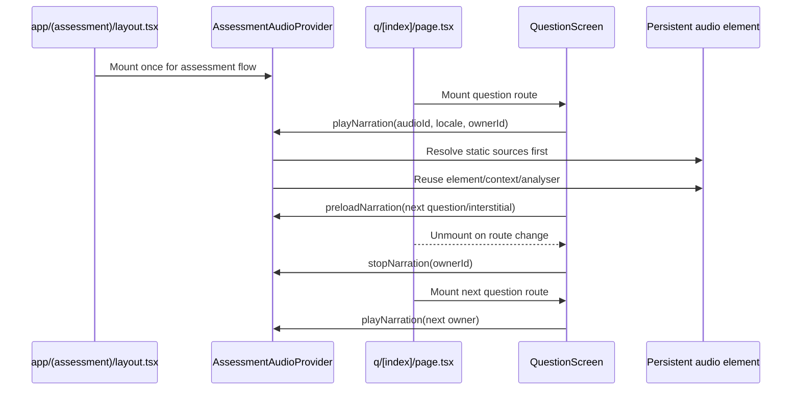

# Assessment Audio Provider Summary

## What Changed

- Added `AssessmentAudioProvider` at the shared assessment layout level so question-route changes no longer recreate the audio engine.
- Moved the assessment narration `<audio>` element, `AudioContext`, `MediaElementSource`, analyser graph, lip-sync loop, mute state, active owner token, replay handling, and bounded preload cache into the provider.
- Refactored `QuestionScreen` to request narration through `useAssessmentAudio()` instead of owning playback infrastructure.
- Refactored `IntroScreen` to use the same provider-owned audio element, and warmed `kai_intro` from `AssessmentStart` before navigating to `/intro`.
- Removed the previous artificial question narration delay; active question/interstitial narration is requested immediately after the screen becomes active.
- Added a source resolver that tries known static assessment audio before `/api/kai-tts`.
- Preloads only the next question and the next likely interstitial for the active locale, with the provider cache bounded to six static preload links.

## Root Cause Addressed

The latency came from question routes remounting `QuestionScreen`. The old implementation created a new `<audio>` element, a new `AudioContext`, a new analyser graph, and a new narration request after every route mount. Playback could only begin after the next page mounted, resolved audio, loaded it, and then called `play()`, with an additional 520ms delay on normal questions.

Now the persistent provider remains mounted under `app/(assessment)/layout.tsx`, while individual question pages can remount cheaply.

The intro delay had a separate cause: it still used the older `useKaiNarration` path, which attempted `/api/kai-tts/kai_intro` before using the baked intro file. `/start` now preloads and starts `kai_intro` through the persistent provider, and `/intro` attaches Kai/video/typewriter behavior to that provider state.

## Current Flow

## Browser Verification

Local server: `http://localhost:3000`

Verified with the in-app browser:

- 10+ transitions across `/q/0` through `/q/10`, including the `/q/9` interstitial.
- Back navigation from `/q/10` to `/q/9`.
- Replay, mute/unmute, and speed-control clicks.
- English static source ordering: `QD*.m4a`, `Q*.m4a`, and `kai_after_10.en.mp3`.
- Arabic question fallback: `/api/kai-tts/QD1?locale=ar` instead of generic English `QD1.m4a`.
- Arabic interstitial static source: `/audio/kai_after_10.ar.mp3`.
- Hidden assessment audio element count stayed `1` across route changes.
- Preload links stayed bounded at six and advanced as the route moved forward.
- `/start` preloaded `/audio/kai_intro.en.mp3`.
- `/intro` used a single provider-owned hidden audio element with `/audio/kai_intro.en.mp3`.

The in-app browser automation surface exposed media element state but did not provide a reliable speaker-output timestamp, so "first audible sample" was verified indirectly through ready media state, source selection, and unit coverage of `play()` behavior rather than an actual audio-device sample.

## Tests Added

- `components/assessment/AssessmentAudioProvider.test.tsx`
  - one persistent audio element/context/analyser across owners
  - duplicate play requests are ignored
  - stale owner stops cannot cancel the new owner
  - replay and mute preference behavior
  - bounded preload cache
  - provider cleanup closes the audio context and removes preload links

- `lib/audio/assessment-audio-sources.test.ts`
  - static English question audio before API fallback
  - Arabic questions avoid generic English static clips
  - localized interstitial audio before API fallback
  - localized intro audio before API fallback
  - fallback source de-duping
  - first preloadable source selection

## Verification Commands

- `pnpm typecheck` passed.
- `pnpm test` passed: 36 files, 356 tests.
- `pnpm lint` passed with 7 pre-existing warnings in unrelated files.

## Files Changed

- `apps/consumer/app/(assessment)/layout.tsx`
- `apps/consumer/components/assessment/AssessmentAudioProvider.tsx`
- `apps/consumer/components/assessment/AssessmentAudioProvider.test.tsx`
- `apps/consumer/components/assessment/AssessmentStart.tsx`
- `apps/consumer/components/assessment/IntroScreen.tsx`
- `apps/consumer/components/assessment/intro-audio.ts`
- `apps/consumer/components/assessment/QuestionScreen.tsx`
- `apps/consumer/lib/audio/assessment-audio-sources.ts`
- `apps/consumer/lib/audio/assessment-audio-sources.test.ts`
- `apps/consumer/lib/audio/use-kai-narration.ts`
- `apps/consumer/vitest.config.ts`

## Risks And Notes

- Arabic question clips are not present as static files, so Arabic question narration correctly falls back to `/api/kai-tts` until Arabic question audio is baked.
- `use-kai-narration.ts` still exists as an unused shared utility, but current assessment intro/question/interstitial narration now uses the persistent provider.
- Browser autoplay policies can still prevent sound until a real user gesture, but the provider now keeps one unlock state and one pending request instead of resetting that work per question route.
- No deployment and no commit were performed.
