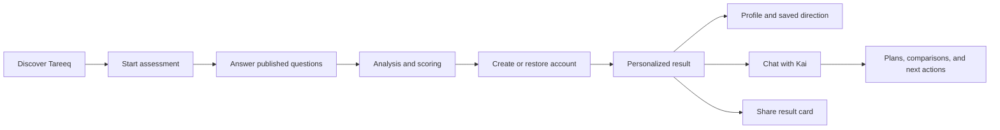
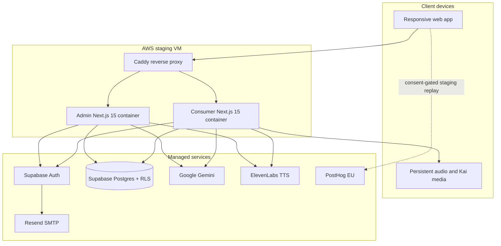
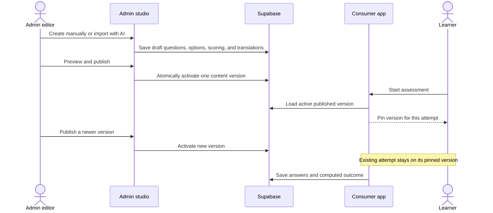
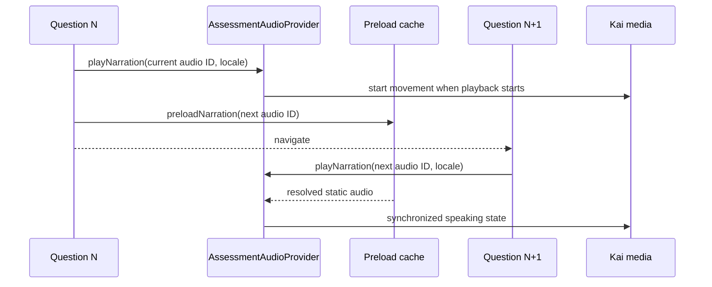
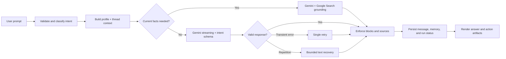
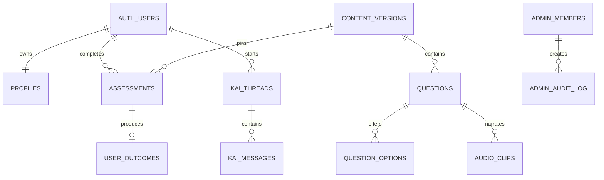
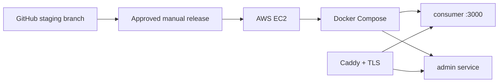

<div align="center">
  
</div>

<br />

<div align="center">
  
</div>

<h1 align="center">A career compass for the next generation</h1>

<p align="center">
  Tareeq helps students and young adults across MENA understand how they think,
  what motivates them, and which directions are worth exploring.
</p>

<p align="center">
  <a href="https://staging.tareek.me"><strong>Open staging</strong></a>
  ·
  <a href="#product-journey">Product journey</a>
  ·
  <a href="#system-architecture">Architecture</a>
  ·
  <a href="./docs/architecture/SYSTEM_ARCHITECTURE.md">Technical reference</a>
</p>

> [!NOTE]
> This repository is private, client-owned product software. Staging is the
> active validation environment. Production release remains a deliberate,
> separately approved operation.

## What Tareeq Includes

Tareeq is a bilingual career-discovery platform made of two connected
applications:

| Surface          | Audience                                 | Purpose                                                                                                                    |
| ---------------- | ---------------------------------------- | -------------------------------------------------------------------------------------------------------------------------- |
| **Consumer app** | Students and young adults                | Marketing site, assessment, personalized results, profile, saved plans, and Kai coaching                                   |
| **Admin studio** | Tareeq operators and content specialists | Assessment creation, AI-assisted importing, scoring, translation, publishing, users, responses, analytics, and team access |

The platform currently supports:

- English and Arabic interfaces with RTL-aware layouts.
- Passwordless email OTP authentication through Supabase Auth.
- Anonymous assessment completion followed by account linking.
- CMS-authored, versioned assessment content with safe attempt pinning.
- Deterministic scoring plus AI-personalized result narratives.
- Kai, a Gemini-powered career guide with persistent chat threads.
- Bilingual, synchronized narration with a persistent browser audio engine.
- Shareable result cards with Arabic text shaping.
- Privacy-conscious PostHog session replay on staging, only after consent.
- Responsive experiences tested across desktop and mobile.

## Product Journey



The assessment can begin without an account. Tareeq pins the active content
version when an attempt starts, so an administrator may publish a newer version
without changing questions beneath someone already in progress.

## Experience Principles

| Principle                        | How it appears in the product                                                                                                 |
| -------------------------------- | ----------------------------------------------------------------------------------------------------------------------------- |
| **Direction, not prescription**  | Results surface patterns and possible paths instead of declaring one “correct” career.                                        |
| **Human before technical**       | Plain language, guided transitions, and Kai’s conversational support reduce assessment anxiety.                               |
| **Bilingual by design**          | English and Arabic copy, typography, narration, layout direction, and exported cards are treated as first-class experiences.  |
| **Fast on real networks**        | Static-first audio, one-question preloading, compressed media, and persistent playback infrastructure reduce perceived delay. |
| **Content can evolve safely**    | Draft, preview, translate, score, and publish workflows are separated; live attempts remain pinned to their version.          |
| **Privacy is a product feature** | Supabase row-level security, server-only credentials, user-data isolation tests, and consent-gated replay protect users.      |

## System Architecture



### Technology Map

| Layer                | Technology                               | Responsibility                                                                           |
| -------------------- | ---------------------------------------- | ---------------------------------------------------------------------------------------- |
| Web                  | Next.js 15, React 19, TypeScript         | Server rendering, route handlers, assessment and dashboard UI                            |
| Styling              | Tailwind CSS, product design tokens      | Responsive English and Arabic interfaces                                                 |
| Motion and media     | Framer Motion, Three.js, HTML media APIs | Scroll storytelling, Kai, and synchronized narration                                     |
| Identity and data    | Supabase Auth, Postgres, RLS             | OTP login, profiles, attempts, results, CMS content, and chat history                    |
| Validation           | Zod                                      | API and model-boundary validation                                                        |
| AI                   | Gemini                                   | Kai chat, grounded answers, admin extraction, translation, and default result narratives |
| Optional AI fallback | Anthropic Claude                         | Configurable result-generation fallback                                                  |
| Voice                | ElevenLabs plus pre-baked assets         | Approved English and Arabic Kai narration                                                |
| Analytics            | First-party events and PostHog           | Product analytics and consented staging session replay                                   |
| Runtime              | Docker Compose on AWS EC2, Caddy         | Isolated consumer/admin services and TLS routing                                         |
| Quality              | Vitest, Playwright, ESLint, TypeScript   | Unit, integration, responsive, and end-to-end checks                                     |

For component boundaries, trust zones, data ownership, and detailed request
sequences, read the
[current system architecture](./docs/architecture/SYSTEM_ARCHITECTURE.md).

## Assessment Content Lifecycle



Publishing is transactional through `publish_content_version`. The consumer
loads the active CMS version on the server, caches it briefly, excludes archived
questions, and falls back to the repository seed only when CMS configuration or
valid published content is unavailable.

## Narration Lifecycle

The assessment layout owns one persistent audio provider across question routes.
Question pages request narration; they do not create their own audio engine.



The provider keeps a persistent `HTMLAudioElement`, `AudioContext`, analyser
graph, autoplay-unlock state, playback token, and one-question preload cache.
English and Arabic use separate approved voices. Static audio is preferred;
the server-side TTS route is a controlled fallback.

## Kai

Kai is a contextual career coach, not a generic chatbot. The chat system uses:

- Gemini streaming for low time-to-first-response.
- Saved threads and messages in Supabase.
- Assessment and profile context without exposing server credentials.
- Intent-specific response schemas and UI artifacts.
- Google Search grounding for factual or current questions.
- Repetition-loop detection, bounded retries, and graceful recovery.
- Scope guardrails for medical and unrelated requests.
- Arabic and English response handling.



The deeper implementation and quality findings live in
[`apps/consumer/docs/kai-audit`](./apps/consumer/docs/kai-audit).

## Data and Security

### Main data domains



### Trust boundaries

- Browser code receives only `NEXT_PUBLIC_*` configuration.
- Supabase service-role, Gemini, Anthropic, ElevenLabs, and database credentials
  stay server-side.
- Row-level security is the primary user-data boundary.
- Admin pages add role checks, while database policies remain authoritative.
- Public result sharing uses opaque share tokens rather than user IDs.
- Assessment results are recomputed and validated at the server boundary.
- Sensitive routes and form content are masked from PostHog replay.
- Secrets, local environment files, SSH keys, and voice references are excluded
  from Git.

## Repository

```text
Tareeq/
├── apps/
│   ├── consumer/                 # Public site, assessment, results, profile, Kai
│   │   ├── app/                  # Next.js App Router pages and API routes
│   │   ├── components/           # Product UI and persistent providers
│   │   ├── lib/                  # Assessment, scoring, auth, AI, data, analytics
│   │   ├── public/               # Brand, narration, Kai, and marketing media
│   │   ├── scripts/              # Verification, quality, seed, and audio tools
│   │   ├── supabase/migrations/  # Consumer-owned schema evolution
│   │   └── docs/                 # Product and implementation notes
│   └── admin/                    # CMS, assessment builder, users, analytics, team
│       ├── app/
│       ├── components/
│       ├── lib/
│       ├── sample-imports/
│       ├── supabase/migrations/
│       └── docs/
├── docs/
│   ├── architecture/             # Current cross-application architecture
│   └── deployment/               # Deployment plans and operational notes
├── .github/workflows/            # Deployment workflow templates
├── AGENTS.md                     # Repository operating instructions
├── CODING_STYLE.md               # Engineering conventions and quality gates
└── README.md
```

## Local Development

### Requirements

- Node.js 22
- pnpm 11
- Access to the project’s Supabase development/staging configuration

Each app is an independent pnpm workspace.

```bash
git clone https://github.com/EnasElgarhy/Tareeq.git
cd Tareeq/apps/consumer
cp .env.example .env.local
pnpm install
pnpm dev
```

Open [http://localhost:3000](http://localhost:3000).

Run the admin studio in a second terminal:

```bash
cd Tareeq/apps/admin
cp .env.example .env.local
pnpm install
pnpm dev -- --port 3001
```

Open [http://localhost:3001/admin/login](http://localhost:3001/admin/login).

### Environment Groups

| Group                  | Examples                                                                             | Exposure                                           |
| ---------------------- | ------------------------------------------------------------------------------------ | -------------------------------------------------- |
| Public app config      | `NEXT_PUBLIC_SUPABASE_URL`, `NEXT_PUBLIC_SUPABASE_ANON_KEY`, `NEXT_PUBLIC_SITE_URL`  | Baked into browser assets                          |
| Session replay         | `NEXT_PUBLIC_POSTHOG_ENABLED`, `NEXT_PUBLIC_POSTHOG_KEY`, `NEXT_PUBLIC_POSTHOG_HOST` | Public identifiers; staging-only and consent-gated |
| Supabase server access | `SUPABASE_SERVICE_ROLE_KEY`, `DATABASE_URL`                                          | Server only                                        |
| AI providers           | `GEMINI_API_KEY`, `GEMINI_MODEL`, `ANTHROPIC_API_KEY`, `ANTHROPIC_MODEL`             | Server only                                        |
| Voice                  | `ELEVENLABS_API_KEY`, voice IDs, model ID                                            | Server and offline bake scripts only               |

Never place a server credential behind a `NEXT_PUBLIC_` prefix.

## Quality Gates

Run these from each changed app before release:

```bash
pnpm typecheck
pnpm lint
pnpm test
pnpm build
```

Consumer-specific checks:

```bash
pnpm test:e2e
pnpm test:isolation
pnpm kai:quality
```

The repository currently contains focused test coverage for scoring,
assessment progress, CMS mapping, audio resolution, auth, persistence, data
isolation, Kai schemas and recovery, Arabic export behavior, analytics privacy,
and responsive acceptance flows.

## Deployment

### Current staging topology

Staging runs on an AWS EC2 virtual machine:



The release operator:

1. Confirms the intended commit on the GitHub `staging` branch.
2. Preserves the VM environment and Compose configuration.
3. transfers/checks out the approved source revision.
4. Rebuilds only the affected Docker Compose service.
5. Verifies `/api/health`, primary journeys, logs, and asset delivery.
6. Keeps the previous release available for rollback.

Deployment is not triggered merely by editing the CMS. Publishing assessment
content updates Supabase and becomes visible to newly started consumer attempts
after the short server cache expires; application code changes still require a
container deployment.

> [!IMPORTANT]
> Files describing App Runner or Cloud Run are historical/future pipeline
> material. They are not the current staging procedure. See
> [AWS deployment notes](./docs/deployment/AWS_DEPLOYMENT.md).

## Documentation Index

| Document                                                                       | Use it for                                                       |
| ------------------------------------------------------------------------------ | ---------------------------------------------------------------- |
| [System architecture](./docs/architecture/SYSTEM_ARCHITECTURE.md)              | Current services, boundaries, flows, data, security, and runtime |
| [Coding style](./CODING_STYLE.md)                                              | Required engineering and review conventions                      |
| [Project completion plan](./apps/consumer/docs/PROJECT_COMPLETION_PLAN.md)     | Milestones, evidence, dependencies, and remaining work           |
| [PostHog staging replay](./apps/consumer/docs/POSTHOG_STAGING_REPLAY.md)       | Consent model, privacy configuration, and tester notes           |
| [Kai experience](./apps/consumer/KAI_EXPERIENCE.md)                            | Kai’s product behavior and interaction model                     |
| [Kai quality audit](./apps/consumer/docs/kai-audit/KAI_QUALITY_STRESS_TEST.md) | Stress-test methodology and quality evidence                     |
| [Scoring methodology](./apps/consumer/docs/methodology/scoring_logic.md)       | Assessment scoring model                                         |
| [Admin setup](./apps/admin/docs/ADMIN_SETUP.md)                                | Admin access and configuration                                   |
| [Versioning rules](./apps/admin/docs/VERSIONING_RULES.md)                      | Draft, publishing, and content-version behavior                  |

Some older architecture files are retained as historical design records. The
root README and `docs/architecture/SYSTEM_ARCHITECTURE.md` are the current
cross-application references.

## Working Agreement

Before making changes:

1. Read [`AGENTS.md`](./AGENTS.md) and [`CODING_STYLE.md`](./CODING_STYLE.md).
2. Preserve English, Arabic, desktop, and mobile behavior.
3. Keep credentials and privileged clients on the server.
4. Add tests in proportion to the behavioral risk.
5. Do not publish content, deploy, or modify production without explicit
   approval.

---

<p align="center">
  <strong>Tareeq</strong><br />
  Find the work that has been waiting.
</p>
