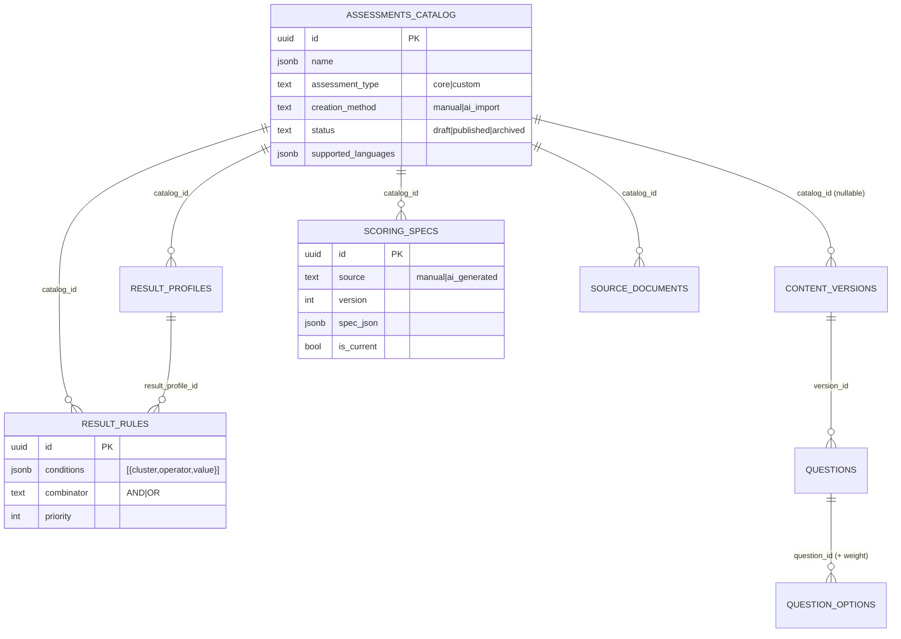

# Hybrid Assessment Creation System — Architecture & Build Plan

> **Branch:** `feat/hybrid-assessment` (off `feat/admin-cms`)
> **Status:** Phase 0 (foundation) implemented and tested. Phases 1–7 specified below.
> **Source:** designed from the live admin-cms code (5-subsystem parallel analysis) + an adversarial review. Decisions confirmed with the product owner 2026-06-14.

---

## 1. Goal & core principle

Let admins create assessments two ways — a **Manual Builder** or **AI Import** (upload existing materials) — that both produce the **same internal structure**, scored by the **same deterministic engine**.

```
Assessment
├── Questions          (version-scoped, bilingual {en, ar})
├── ScoringSpec        ({clusters, profiles, rules} — execution artifact)
├── ResultProfiles     (named outcome buckets, bilingual)
├── Rules              (deterministic IF conditions THEN profile)
├── Metadata           (type, creation_method, status, languages)
└── SourceDocuments    (original uploads, AI-import only)
```

**The invariant, enforced structurally — AI NEVER SCORES A USER.**
AI only reads admin-uploaded documents and emits a `ScoringSpec`. The scoring engine (`lib/scoring/spec-executor.ts`) takes only `(answers, questions, spec)` — it never receives AI text or a user identity. Scoring is deterministic, backend-executed, reproducible, testable, and auditable.

---

## 2. Confirmed decisions

| # | Decision | Choice |
|---|---|---|
| 1 | Scoring dispatch | **Separate engines by type.** `type='core'` → existing `computeScore` (untouched, snapshot-tested). `type='custom'` → new `executeScoringSpec`. No shared mutable state; the live student flow is unaffected. |
| 2 | "Assessment" home | **New `assessments_catalog` table.** Identity-level. `content_versions` gets a nullable `catalog_id`. Questions stay version-scoped; profiles/rules/specs/docs are catalog-scoped. |
| 3 | AI extraction provider | **Gemini primary, Claude fallback** — reuses the existing `pickProvider()` abstraction with a `responseSchema` override. |
| 4 | Source-document storage | **Wire Supabase Storage now.** Private `assessment-sources` bucket holds the original PDF/DOCX; `source_documents.storage_path` references it; `extracted_text` holds the AI input. Admins can download originals ("view original documents"). |
| 5 | Core vs Custom | `Core` = existing CORE archetype engine. `Custom` = rule-based ResultProfiles via ScoringSpec. The chooser's "Assessment Type" selects which engine scores. |
| 6 | Rule precedence | **First-match.** Lower `priority` fires first; ties broken deterministically by rule `id`. Auditable and easy for admins to reason about. |

---

## 3. Data model

New tables (migration `supabase/migrations/202606140001_assessment_catalog.sql`, additive, admin-only RLS for **all** CRUD):

| Spec entity | Table | Scope |
|---|---|---|
| Assessment | `assessments_catalog` | root identity |
| Question | `questions` (existing) | `content_versions.id` |
| ResultProfile | `result_profiles` | catalog |
| Rule | `result_rules` | catalog |
| ScoringSpec | `scoring_specs` | catalog |
| SourceDocument | `source_documents` | catalog |



**Critique fixes baked into the migration:**
- **Admin INSERT/UPDATE/DELETE policies** on every new table (not SELECT-only) — closes the write-side RLS hole (CRITICAL-1).
- **`is_current` enforced by a partial unique index** `scoring_specs(catalog_id) where is_current` — at most one current spec per catalog, atomically (CRITICAL-3). Same pattern guards one `is_fallback` profile per catalog.
- `question_options.weight numeric(5,2) default 1 check (>0)` — the missing weight column.
- `clusters.name_i18n / description_i18n` jsonb, backfilled with Arabic names for the 8 Core clusters.
- `source_documents.file_type` is `check`-constrained (csv/pdf/docx/md/txt), not free text (LOW-3).
- The `assessment-sources` Storage bucket + admin-only `storage.objects` policies.

> **Not yet applied to the live Supabase DB.** The migration file exists; applying it alters the real project (`hiffzrbctjxoekthfbyg`). Apply via `supabase db push` / the SQL editor when ready — it's additive and re-runnable.

---

## 4. Scoring-Spec engine (Phase 0 — DONE)

Pure, deterministic, decoupled from the Core engine. Cluster keys are open strings, so a Custom assessment can define its own taxonomy (no coupling to the Core `ClusterCode` union — HIGH-1).

**Files:**
- `lib/scoring/spec-types.ts` — `ScoringSpec`, `ResultRule`, `RuleCondition`, `SpecResultProfile`, `SpecOutcome` (+ audit types).
- `lib/scoring/spec-executor.ts`:
  - `computeClusterTotals(answers, questions)` — the only bridge from answers → cluster totals (sums `option.weight`, default 1).
  - `executeScoringSpec(clusterTotals, spec)` — first-match rule evaluation → `SpecOutcome` with an audit trail.
  - `scoreCustomAssessment(answers, questions, spec)` — convenience end-to-end path the live route will call for `type='custom'`.
- `lib/scoring/spec-executor.test.ts` — 28 table-driven tests.

**Determinism contract (tested):** total rule order (priority, then id); first-match wins; zero-condition rules never match; `isFallback` profile on no-match; **epsilon + fixed-precision rounding** so decimal weights (`0.1 + 0.2`) compare correctly on `=`/`!=` (HIGH-6). No `Date`, no `Math.random`, no IO.

**Why this was the right first slice (HIGH-7 correction):** the engine is pure and testable in isolation, *and* the integration tests exercise the full `answers → computeClusterTotals → executeScoringSpec` path — so the riskiest linkage (question data → cluster totals → spec) is proven before any UI exists.

---

## 5. AI Import pipeline (Phase 5)

- **Parsing libs to add (server-only, `runtime='nodejs'`):** `papaparse` (CSV), `pdf-parse` or `pdfjs-dist` (PDF), `mammoth` (DOCX); Markdown/plain text read directly.
- **Extraction call:** a new `extractScoringSpec({ questionsText, scoringText, targetLocales })` provider call reusing `pickProvider()` with a `responseSchema` that returns `{ questions[], clusters[], profiles[], rules[], confidence, detectedLanguage }`. **Signature takes only document text — never answers or a user id.** A module-level comment + (recommended) lint rule keeps the import path free of `body.answers` (the existing results path's `buildFineTunePayload` must never be reused here — MEDIUM-6).
- **Bilingual:** AI auto-detects language; if one language is missing it generates the other and flags it `aiGenerated` for admin review.
- **Storage:** original file → `assessment-sources` bucket; `extracted_text` + `storage_path` saved to `source_documents`.
- **Output is a draft.** The admin reviews/edits everything on the Review screen before publish. Confidence is surfaced per section.

---

## 6. Admin UI / routes

- `/admin/content/new` — **Choose Creation Method** chooser (Manual Builder | AI Import).
- **Manual wizard:** `Setup → Questions → Scoring → Preview → Publish`. Reuses `QuestionBuilder`/`QuestionEditor`/`OptionsBuilder`; new **Scoring step** = Cluster Configuration panel + ResultProfiles CRUD + **Rule Builder** (condition/operator/value rows, AND/OR, target profile).
- **AI Import wizard:** `Setup → Upload Questions → Upload Scoring → AI Conversion → Review → Publish`.
- **Assessment detail tabs:** `Questions | Scoring | Results | Analytics | Translations`. Scoring tab shows source (manual/ai_import), clusters/profiles/rules, Download JSON, View Original Documents, Regenerate Spec.
- **Server actions** (following the existing `'use server'` + `requireAdmin()` + Zod + `revalidatePath` pattern): `createAssessment`, `updateAssessmentSetup`, `saveResultProfile`/`deleteResultProfile`, `saveRule`/`deleteRule`/`reorderRules`, `assembleAndPublishSpec`, `uploadSourceDocument`, `runAiExtraction`, `applyExtractedDraft`, `validateAssessment`, `publishAssessment`.

---

## 7. Bilingual model

- All localized text is `Record<locale, string>` jsonb (questions/options already are; clusters + result_profiles now too). Extensible to more locales — no `en`/`ar` columns.
- **Question editor gets EN/العربية tabs**; both languages live in one row. (Note: `addQuestion`/`importQuestionsCsv` currently hardcode `title: { en }` — HIGH-2/MEDIUM-5; Phase 2 threads both locales through.)
- **Translations tab:** coverage view + lists of questions/profiles/clusters missing a locale + AI-translation status badges.
- **Publish validation:** block if any question/profile/cluster is missing a supported locale, unless the admin chooses *"Publish single-language assessment"* (records `published_locales`).
- **Scoring is language-independent by construction:** `computeClusterTotals` + `executeScoringSpec` read `cluster_code` + `weight` only — never localized text. Identical results regardless of selected language. ✅

---

## 8. Phased build plan

| Phase | Goal | Proof |
|---|---|---|
| **0 ✅** | Scoring-spec engine + migration + weight column | `spec-executor.test.ts` (28 tests), `tsc` clean, no Core regression |
| **1** | Catalog server actions + Manual Setup step + creation-method chooser; wire questions→catalog→version linkage | create a draft assessment end-to-end; integration test of the version linkage |
| **2** | Questions step with bilingual EN/AR editor tabs; thread both locales through add/CSV | round-trip a bilingual question |
| **3** | Manual Scoring step: ResultProfiles CRUD + Rule Builder; assemble `spec_json` | assemble a spec; `validateScoringSpec` unit tests |
| **4** | Preview (orphan-cluster/invalid-rule/missing-profile validation) + Publish + detail tabs | publish a Custom assessment; dual-source content list handles legacy `catalog_id IS NULL` rows |
| **5** | AI Import: upload → parse → extract → review; Supabase Storage | import a real PDF/DOCX into a reviewable draft |
| **6** | Translations tab + bilingual publish validation + AI auto-translate | block/allow publish per locale coverage |
| **7** | Scoring route dispatch (live Custom scoring) + Analytics tab | a `type='custom'` assessment scores a real submission via `scoreCustomAssessment` |

**Phase 7 carries the CRITICAL-2 follow-up:** the live scoring route currently has no `catalogRow`. Dispatch must default to the Core path when `assessmentId`/`catalog_id` is absent, so the student flow never breaks. This is wired only when Phase 7 lands.

---

## 9. Open items carried forward (from the adversarial review)

- **HIGH-2 / MEDIUM-5:** `addQuestion` + `importQuestionsCsv` hardcode `title: { en }` — fix in Phase 2 (bilingual threading).
- **HIGH-4:** extending `providers.ts` must not break the existing results path's type safety — additive `responseSchema` override only.
- **HIGH-5:** content list becomes dual-source (legacy `catalog_id IS NULL` + new catalog rows) — Phase 4 query must separate them cleanly.
- **MEDIUM-3:** `validateScoringSpec` runs both client (Preview) and server (publish) — share one pure validator.
- **MEDIUM-7:** Drizzle `db/schema.ts` and the Supabase migration are maintained separately — add the new tables to `db/schema.ts` in Phase 1 and note no `drizzle-kit migrate` at runtime.
- **MEDIUM-8:** rule-condition cluster codes must have i18n names so the Results tab never renders empty strings.
```
