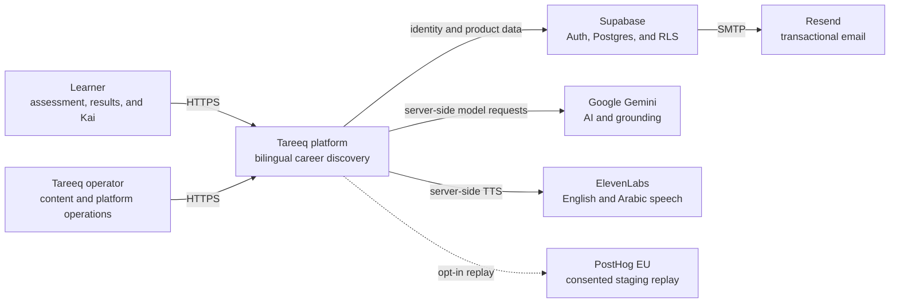
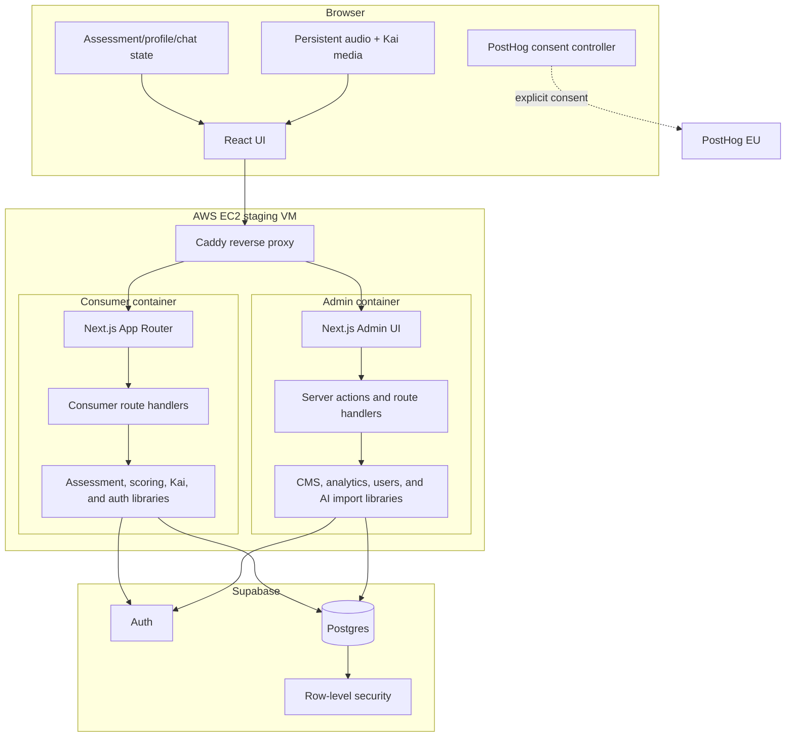
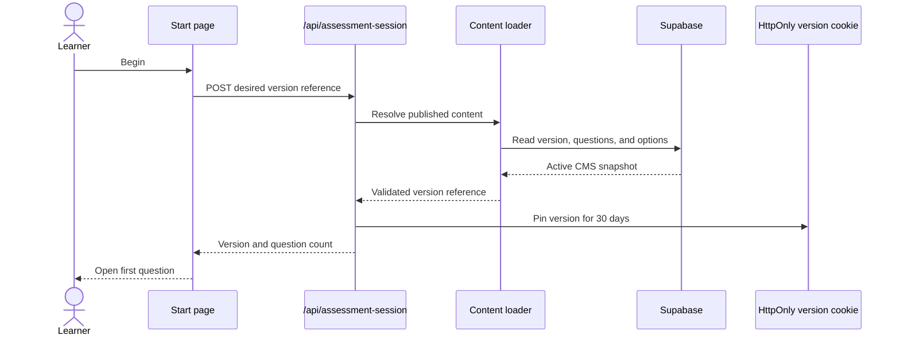
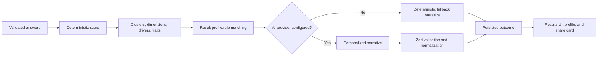
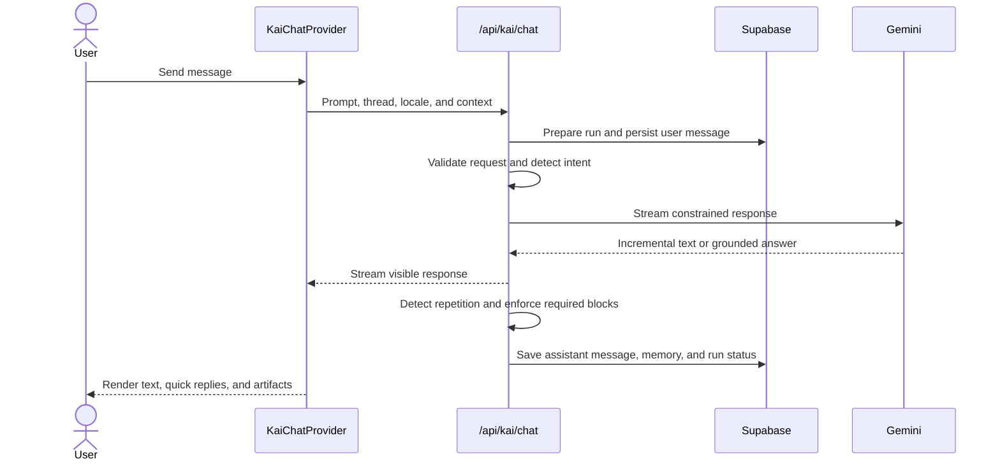
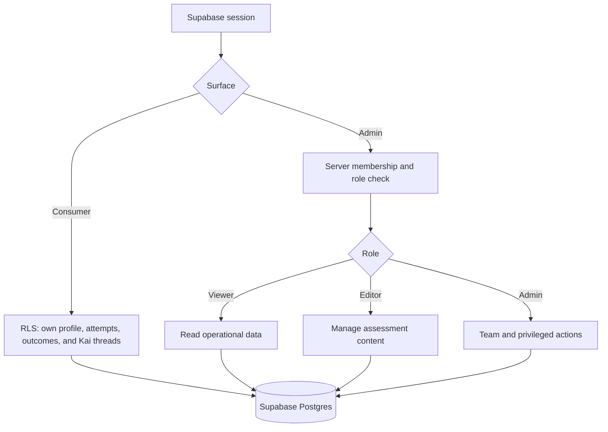

# Tareeq System Architecture

> **Status:** Current-state technical reference
>
> **Last reviewed:** July 23, 2026
>
> **Scope:** Consumer app, admin studio, Supabase, AI/voice providers,
> analytics, and the AWS staging runtime

This document explains the architecture implemented in the repository today.
Historical planning documents remain useful as decision records, but this file
and the root `README.md` are the current cross-application references.

## 1. Architectural Goals

Tareeq is optimized for five properties:

1. **A guided bilingual experience.** English and Arabic must have equivalent
   content, narration, layout quality, and result behavior.
2. **Safe content evolution.** Admins can change or remove questions without
   corrupting attempts already in progress.
3. **Trustworthy personalization.** Scoring is deterministic and auditable;
   generative AI enriches the narrative instead of owning the underlying score.
4. **Useful AI with bounded failure.** Kai streams quickly, saves threads,
   validates structured output, and degrades gracefully.
5. **A small operational footprint.** Two Next.js services share managed
   Supabase infrastructure and run as isolated Docker Compose services on one
   staging VM.

## 2. Context



## 3. Container Boundaries



### Consumer responsibilities

- Public marketing and product education.
- Passwordless user authentication.
- Assessment start, progress, narration, scoring, and persistence.
- Personalized result generation and sharing.
- Authenticated profile, exploration, and plan views.
- Kai chat threads, streaming responses, and structured artifacts.
- Consent-gated staging session replay.

### Admin responsibilities

- Role-gated operator access and invitations.
- Assessment catalog, manual builder, AI import, question editor, categories,
  scoring specs, result profiles, rules, translations, and preview.
- Atomic content publishing and audio regeneration.
- User records, response review, exports, analytics, and quality views.
- Team roles and audit logging.

The services may share database tables, but they do not share browser bundles or
deployment lifecycles.

## 4. Consumer Route Map

```text
app/
├── (marketing)/       public landing, about, FAQ, model, parents, research, students
├── (assessment)/      start, contract, intro, questions, analyzing, register, results
├── (app)/             home, profile, explore, Kai, plans
├── api/
│   ├── assessment-session
│   ├── assessments/persist
│   ├── assessments/share
│   ├── kai/chat
│   ├── kai/threads
│   ├── kai-tts/[audioId]
│   ├── results/generate
│   ├── analytics/ingest
│   └── health
├── share/[token]/
└── signin/
```

Question pages are separate routes, but the `(assessment)` layout persists
across route changes. That layout owns locale, language gating, assessment
chrome, CMS content, and the audio provider.

## 5. Admin Route Map

```text
app/admin/
├── login
├── accept-invite
├── auth/callback
└── (shell)/
    ├── overview
    ├── content/
    │   ├── new
    │   └── [versionId]/
    │       ├── questions
    │       ├── custom / AI import
    │       ├── scoring
    │       ├── translations
    │       └── preview
    ├── users
    ├── responses
    ├── analytics
    └── team
```

## 6. Assessment Versioning

### Read path

1. The server checks the attempt-version cookie.
2. A pinned version ID loads published CMS content.
3. Without a pin, the single active version is loaded.
4. Questions and options are normalized and validated.
5. Archived questions are excluded.
6. Valid content is cached for 30 seconds.
7. The checked-in seed is a resilience fallback when CMS configuration or
   published content is unavailable.

### Start and pin sequence



### Publish sequence

The admin calls the `publish_content_version` database function. The function
serializes publishing, deactivates the previous version, activates the target,
and records publication state in one transaction. This prevents a zero-active
or two-active race.

An existing attempt continues using its version cookie. A new attempt sees the
new version after the content cache refreshes.

## 7. Scoring and Results



The score and result inputs remain reproducible. AI is used for expressive,
personalized prose within the computed result boundaries. Invalid provider
output is rejected or normalized before persistence.

## 8. Audio and Kai Media

### Persistent audio engine

`AssessmentAudioProvider` lives in the shared assessment layout and owns:

- one `HTMLAudioElement`;
- one `AudioContext`;
- one source/analyser graph;
- autoplay-unlock state;
- a monotonically changing playback token;
- narration source resolution;
- one-question preload cache;
- analyser values used to synchronize Kai.

Route-level question components request playback and preloading. Cleanup is
token-aware so a late request from the previous route cannot take over current
playback.

### Resolution policy

1. Use locale-specific approved static narration when present.
2. Reuse a resolved/preloaded source for the next question.
3. Use the server-only TTS route for supported fallback content.
4. Never expose the ElevenLabs key to the browser.

Kai enters the speaking state when audio playback starts, rather than when the
screen mounts. This keeps motion and speech perceptually aligned.

## 9. Kai Chat

### Request lifecycle



### Reliability behavior

- A 15-second bounded provider attempt prevents unbounded perceived waits.
- Transient errors receive one controlled retry.
- Degenerate repetition loops are detected before JSON parsing.
- Complex artifact failures fall back to a bounded text recovery.
- Grounded intents require sources; missing grounding is not silently presented
  as verified fact.
- In-progress state is provider-level rather than page-level, so changing app
  tabs does not discard the active reply.

## 10. Authentication and Authorization

### Consumer auth

The consumer uses Supabase email OTP:

1. `signInWithOtp` sends a numeric code and may create the user.
2. `verifyOtp` exchanges the code for a cookie-backed session.
3. Anonymous assessment data is linked/restored after authentication.
4. Dashboard access requires a prior completed assessment unless the user is
   restoring an existing profile.

### Admin auth

Admin invitations and login use Supabase sessions plus application-level role
membership. Invite callbacks support Supabase hash sessions and route users to
the acceptance flow. UI checks improve the experience; database policies and
server-side membership checks enforce access.

### Authorization model



## 11. Data Ownership

| Domain               | Representative tables                                      | Primary writer             |
| -------------------- | ---------------------------------------------------------- | -------------------------- |
| Identity             | `auth.users`, `profiles`, `user_accounts`                  | Supabase Auth and consumer |
| Assessment content   | `content_versions`, `questions`, `question_options`        | Admin                      |
| Assessment model     | catalogs, categories, scoring specs, result profiles/rules | Admin                      |
| User assessment data | `assessments`, `assessment_data`, `user_outcomes`          | Consumer APIs              |
| Kai                  | `kai_threads`, `kai_messages`                              | Consumer Kai APIs          |
| Audio metadata       | `audio_clips`                                              | Admin generation workflow  |
| Operations           | admin members, invitations, notes, flags, audit log        | Admin                      |
| Analytics            | analytics events and aggregates                            | Consumer/admin ingestion   |

Migrations are mirrored where both apps need a shared schema change. Apply a
shared migration once to the target Supabase project; the duplicate file is a
repository ownership convenience, not an instruction to run SQL twice.

## 12. Analytics and Replay

Product event ingestion and PostHog replay are separate concerns.

PostHog replay is:

- disabled unless `NEXT_PUBLIC_POSTHOG_ENABLED=true`;
- intended for staging family-and-friends testing;
- started only after explicit user consent;
- configured to mask form inputs and sensitive text;
- configured without request/response body or header capture;
- stopped when the user withdraws consent;
- not used to identify users by email.

Tracking protection may block PostHog in some browsers. This does not affect the
core application.

## 13. Runtime and Deployment

### Staging

- One AWS EC2 VM.
- Caddy terminates TLS and routes hostnames.
- Docker Compose runs consumer and admin independently.
- Consumer listens internally on port 3000.
- Environment files and server credentials live on the VM, outside Git.
- Releases are manual and operator-approved.
- A pre-deploy release backup supports rollback.

### Release boundary

| Change                                        | Requires app deploy?                                   |
| --------------------------------------------- | ------------------------------------------------------ |
| Publish/edit assessment content in the admin  | No; newly started attempts see it after cache refresh  |
| Update scoring/runtime code                   | Yes                                                    |
| Update UI, API routes, static audio, or media | Yes                                                    |
| Update Supabase Auth/SMTP settings            | No app deploy, but requires configuration verification |
| Add/alter database schema                     | Migration first, then deploy dependent code            |
| Change a server environment variable          | Container recreate/restart                             |
| Change a `NEXT_PUBLIC_*` value                | Rebuild, because it is baked into browser assets       |

## 14. Failure Modes and Fallbacks

| Failure                           | User-visible behavior                               | Protection                             |
| --------------------------------- | --------------------------------------------------- | -------------------------------------- |
| CMS unavailable or invalid        | Assessment still starts from seed content           | Server-side validated fallback         |
| New content published mid-attempt | No question reshuffle                               | Version pin                            |
| Static narration unavailable      | Controlled TTS fallback or silent readable UI       | Source resolver and mute/skip controls |
| Slow AI response                  | Streaming progress, bounded timeout, retry/recovery | Kai run lifecycle                      |
| Invalid AI result JSON            | Deterministic result remains available              | Schema validation and fallback         |
| PostHog blocked                   | Core app continues normally                         | Analytics is non-critical              |
| Expired auth link                 | User can request a fresh OTP/invite                 | Supabase auth flow                     |
| Container regression              | Previous release can be restored                    | Manual release backup                  |

## 15. Quality Strategy

### Static gates

- TypeScript type checking.
- ESLint.
- Prettier consistency.
- Production Next.js builds.

### Automated tests

- Assessment content normalization and version references.
- Scoring fixtures and profile results.
- Progress restoration across changing question sets.
- Audio source resolution and provider lifecycle.
- Auth and user-data isolation.
- API validation, persistence, and sharing.
- Kai intent, streaming, schemas, artifacts, repetition detection, and recovery.
- Arabic document/share rendering.
- PostHog privacy rules.
- Responsive Playwright acceptance flows.

### Release checks

1. Build both affected services.
2. Run focused tests and the full suite appropriate to the blast radius.
3. Verify English and Arabic.
4. Verify mobile and desktop.
5. Smoke-test `/api/health`.
6. Test the primary changed journey on staging.
7. Inspect container logs before declaring the release complete.

## 16. Key Design Decisions

| Decision                              | Reason                                                  |
| ------------------------------------- | ------------------------------------------------------- |
| Separate consumer and admin apps      | Clear security, bundle, and release boundaries          |
| Shared Supabase project               | One source of truth for identity, content, and outcomes |
| Route-per-question                    | Deep links, browser navigation, and explicit progress   |
| Persistent assessment audio provider  | Eliminates media teardown between question routes       |
| Version pin per attempt               | Protects scoring integrity while content evolves        |
| Deterministic score plus AI narrative | Combines auditability with personal expression          |
| Passwordless OTP                      | Low-friction account creation after assessment          |
| Gemini schemas plus recovery          | Rich UI artifacts without accepting malformed output    |
| Manual staging deploy                 | Matches current infrastructure and approval process     |

## 17. Known Operational Notes

- The repository contains legacy App Runner and temporary Cloud Run materials.
  They are not the live staging path.
- `apps/consumer/ARCHITECTURE.md` and its admin counterpart describe an earlier
  migration plan; do not treat their hosting or question-count claims as current.
- Publishing a CMS version depends on the
  `202607210001_published_assessment_versions.sql` migration.
- Assessment static audio and marketing video are performance-sensitive release
  assets; optimize without reducing Kai’s visible quality.

## 18. Further Reading

- [`README.md`](../../README.md)
- [`CODING_STYLE.md`](../../CODING_STYLE.md)
- [`apps/consumer/docs/PROJECT_COMPLETION_PLAN.md`](../../apps/consumer/docs/PROJECT_COMPLETION_PLAN.md)
- [`apps/consumer/docs/POSTHOG_STAGING_REPLAY.md`](../../apps/consumer/docs/POSTHOG_STAGING_REPLAY.md)
- [`apps/admin/docs/VERSIONING_RULES.md`](../../apps/admin/docs/VERSIONING_RULES.md)
- [`apps/admin/docs/HYBRID_ASSESSMENT_SYSTEM.md`](../../apps/admin/docs/HYBRID_ASSESSMENT_SYSTEM.md)
- [`apps/consumer/docs/kai-audit`](../../apps/consumer/docs/kai-audit)
